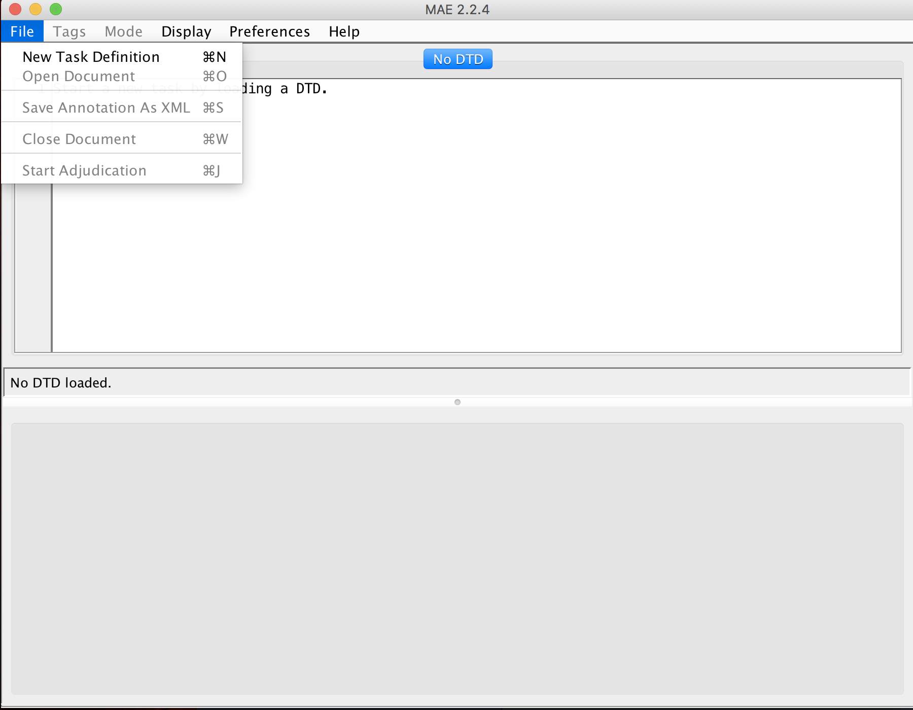
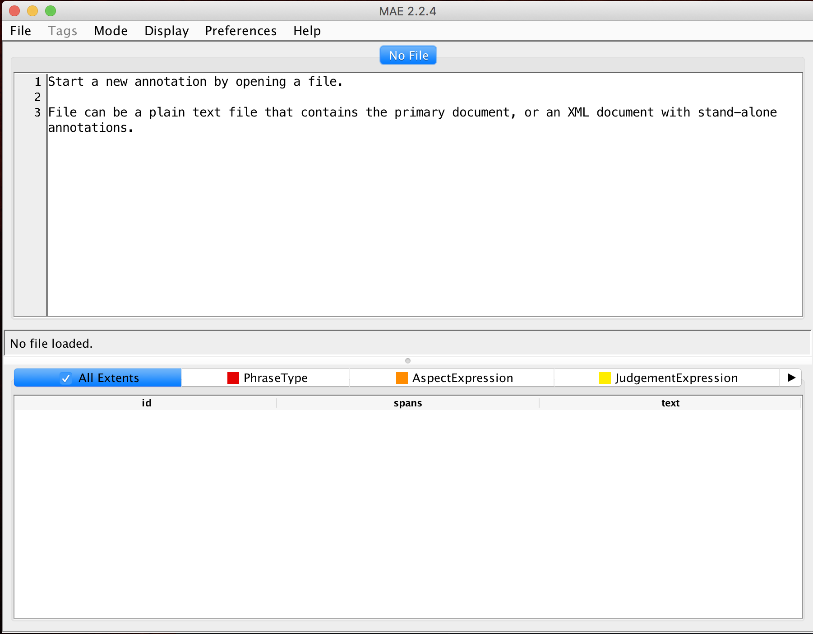
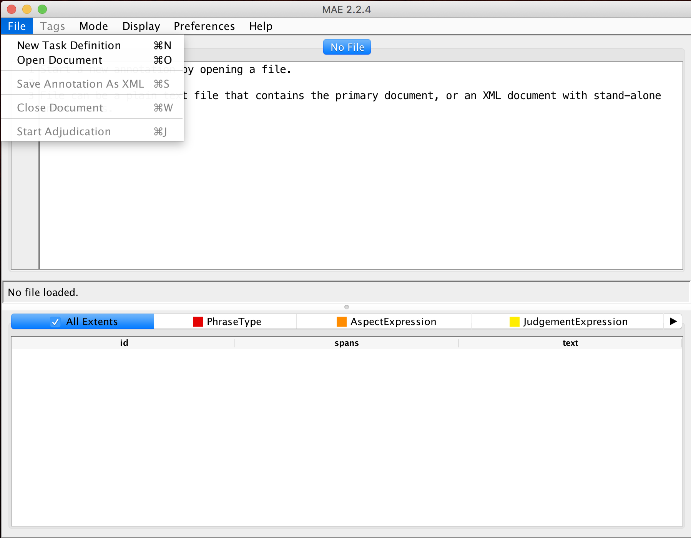
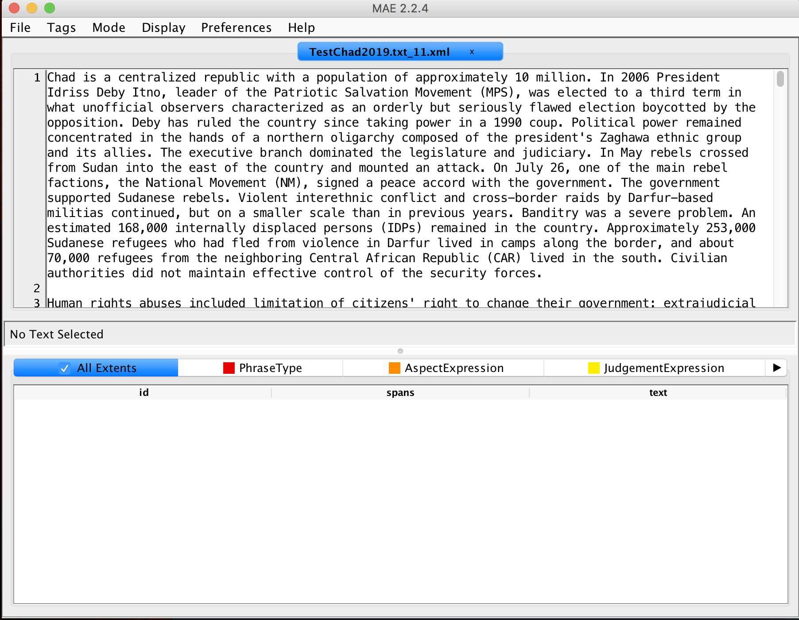

# Direction to Annotate using PULSAR-rules


## Installation

0. Download `mae-2.2.4-fatjar.jar`, from https://github.com/keighrim/mae-annotation/releases

1. Open the java interface at the terminal:
`java -jar mae-2.2.4-fatjar.jar`

If you get an error you may need to install java and the java jdk. Please install Java version >8. These are available [here](http://www.oracle.com/technetwork/java/javase/downloads/index.html)

2. If mae opened just fine, then you need to open the document-type definition file by going to **File** menu (top left),

then select **New Task Definition**, and find `PULSAR.dtd`. That should load the possible annotation types, and there should now be different colors and names towards the bottom of the screen, like so:


3. Then open the file to annotate, by going to the **File** menu again, selecting **Open Document** and selecting your next document.

This is an example of what the resulting screen should look like, but you will have a different document.
!


## Goals

The goals are to mark up human rights reports so that we can identify what aspects of human rights are being judged over time, as well as who are the perpetrators, victims and sources of information are. We have special tags for negation too, as that reverses a judgment.

## Definitions

- *Aspects of human rights*: Rights are moral or legal rules. They are abstract in the sense that a specific person, place or thing is not a right. Privacy is a right. Physical integrity, meaning not having someone threaten, torture or attack you, is a right. The aspects are conceptually separate from the judgments offered on them (See below). Aspects are often noun phrases, but not proper nouns. There are seven broad classes of rights:
    + Physical integrity rights
    + Civil liberties
    + Political rights
    + Government corruption and transparency
    + Discrimination, societal abuse and Trafficing in persons
    + Worker's rights
    + Government attitude towards international and nongovernmental investigations of alleged violations of rights

*We also have a list of over 100 aspects in this [file](Aspect_Categories_with_Natural_Language_Interpretation.csv). When in doubt you can search this file to see if a phrase or something close comes up. If it does, then this should be an aspect.* As one example, `excessive force` is an aspect in this file.

- *Judgment of protection or violation of an aspect of human rights*: These reports provide information about whether a country, in a given year, has protected or violated specific types of rights; and provides information and events related to those claims. A judgment tells us either directly or indirectly whether a right has been violated protected, or possibly that there is no information about this. One way to think about whether a phrase is an aspect of human rights or a judgment on an aspect is to think about whether you could attach multiple different judgments to that expression. For example, in the phrase: `Security forces committed widespread torture`, the aspect is torture, a form of physical integrity right. We could imagine another sentence that stated, `There were no reports that the Security forces used torture`, same aspect, different judgment. Judgments are often verbs, adverbs or adjectives.

- *Perpetrator*: These are the people or groups, often proper nouns, who have been the actors in the judged actions. Perpetrators usually are identified in these documents as having done negative things, but that is not always the case. A group can perpetrate a peace agreement, for example. Note that perpetrators can be `The Constitution` or `laws` in some instances; such as `The Constitution prohibited censorship`. In this example the `Constitution` is the perpetrator as it is acting; the aspect is `censorship`; and the judgment is `prohibited`.

- *Victim*: These are people or groups, often proper nouns, who have been acted upon in the judged actions. Victims in these documents are often the ones suffering from the abuse of these rights. However, people can be acted upon in a positive sense (for them), as they could be given immunity by the government.

- *Source of information on the judgment*: While we know the author the reports (eg the US State Department or Amnesty International), often they are writing about others. The source of the judgment is often media reports, other NGOs. They can also be the opposition or even the government. The absence of reports is itself a source. So in the phrase `There were no reports that the Security forces used torture`, `no reports` is the source of the information on the judgment. Try and ensure that `reports` or `no reports` are sources of information and not judgments (but see negation section below for the use of `no` in cases like this to modify judgments).

- *Location*: A specific place that you could point to on a globe, usually proper nouns, but not always. These can be cites, countries, regions, or specific houses. When tagging, include articles like `across` and `in` if they are present and contiguous.

- *Time*: A specific time or date. This helps us track when the reports are talking about past events and when they are talking about current events. When tagging, include articles like `during` and `on` if they are present and contiguous.

- *Negation*: There are special words that invert a judgment, these negate a judgment. These words are important to our project and we want to capture as many as we can. `The government did not protect civil liberties` carries a very different judgment as compared to `The government did protect civil liberties`, because of the negation `no`.

- *Phrase type*: More generally, there are many phrases or whole sentences that do not offer a clear judgment. In that case, we are not interested in those and they can be tagged as either an old event or fact, a current event or fact, or as ambiguous. For example `10 years ago, the President was elected.` is an old fact/event.


### Tagging Chucks of Contiguous or Discontinuous Text as Entities

For our purposes text can tell us about any of the previously defined concepts. We have designed *tags*, also known as *entities*, for you to use to denote what semantic role a phrase or word is playing in a sentence. These are defined in the PULSAR.dtd file. The point of the MAE software is to allow you to efficiently annotate the text, marking the language in documents with the appropriate tags.

To make a tag, when in normal mode (see next paragraph), simply select the text and then control-click on that highlighted text. Then select the extent tag that is appropriate.

Importantly, tags can be continuous, where you are just highlight from left to right or right to left, contiguous characters and/or white space; or discontinuous, where there is a gap between the words that are part of the same tag. For example, the phrase `Extreme surveillance by the government was widespread.` The judgment here is discontinuous because it includes `extreme` and `was widespread`. In MAE there is a mode for discontinuous span selection. Just select **Mode**, then **Switch to discontinuous span selection**. Then just do command-e to switch back to regular mode, or click on **Mode** again and then **Return to normal mode**.

Every time you tag a section of text, it creates meta data on the tag type, and where the span begins and ends (with multiple values if the span is discontinuous). You can see some of this near the bottom of the screen.

To delete a tag. Control-click on it.

*One note of warning: it is common when highlighting text to miss the first or last letter of a span, please try and be careful with this.*

### Tagging Links Between Entities

In addition, we want to identify connections between these tagged chunks of text. Specifically, we want to be able to identify links:

1) between a judgment and the aspect of human right the judgment is offered on
2) between the perpetrator judged and the judgment of their action
3) between the victim of a judged action and the judgment
4) between the source of information for a judgment and the judgment
5) between negation and the what is being negated, particularly the judgment
6) between a location and what is located there
7) between a time what took place at that time

These are each types of relations are *links*.

To code links, you first need to have the tags/entities coded. When you have the entities all coded for a sentence, and you are ready to create links, select **Mode**, and then **Switch to argument selection mode**, to create links you are selecting the arguments. You can also **Switch to argument selection mode" with the command-2 shortcut. In this mode, select anywhere in the tag for the first part of the link and click, then select anywhere in the tag for the second part of the link and click. You should see at least two discontinuous highlighted sections. Control-click on one of these, and select the appropriate link. A dialog will pop up that will let you choose the appropriate link type.


##Saving your annotations
After you have diligently annotated a file, make sure you save your annotation in a particular format. First go to **File** and then **save annotations**. The name of the saved annotation file should be NameOfFileAnnotated_YourInitials.xml. If your initials are ABC, and you are annotating a file TestCode21.txt, then you should save your annotation as TestCode21.txt_ABC.xml. You can save a file that you are not finished annotating and then reload it also. Saving every 15 to 30 minutes is a good idea.


### Examples

- Judgments are often verb phrases and aspects (non-proper) noun phrases that include human rights terms, and perpetrators or victims are noun phrases with people as the root of the terms. For example the sentence:
    ```
    Security forces committed politically motivated killings.
    ```
has `politically motivated killings` as the aspect, `committed` as the judgment, and `Security forces` as the                  perpetrator.   It then has a __FromPerpetratorToJudgement__ link (`Security forces`,`committed`) and a                          __FromJudgementToAspect__ link (`committed`,`politically motivated killings`). If a specific person or proper noun is         named, that is not an abstract aspect of human rights that is being violated or protected, but instead is usually a           victim or a perpetrator.

- If is important to keep judgment words, like `systematic`, `intense` and `severe` in the judgment expressions, unless a particular term in question terms is part of an explicit aspect in the list of aspects noted above (`excessive force`, `unlawful interference with Privacy`, `arbitrary arrest and detention`).

- Some expressions are both an aspect and a judgment at once in a sentence. In the phrase: `Abuses included killing`, `killing` is both the aspect (within physical integrity rights) and the judgment, they did it, although that fact is implied. There is a special extent tag for this: JointJudgementAspectExpression. This should be used sparingly, but it will be necessary.

- Sentences with `of` can be confusing because the judgment and aspect are often connected in an ambiguous way. In this example:
```
Civilian authorities did not maintain effective control of the security forces.
```
One could think of the `security forces` as the aspect, then the the judgment is `did not maintain effective control of`.  Alternatively, one could think of `control of the security forces` as the aspect and then the judgment would be `did not maintain effective`. In this case, the second coding is slightly preferable, but only because `control of the security forces` is a relatively common phrase and security forces are groups that are more likely to be perpetrators. However, this phrase is not in the aspect list, making this more difficult. The `civilian government` is the perpetrator.

- Related to the previous point, keep the phrase `rule of law`, `freedom of speech`, `freedom of expression`, `freedom of movement`, `freedom of assembly`, `freedom of association`, `freedom of press`, `extrajudicial killing`, etc. together. These are multi-word expressions that denote specific aspects, and are included in the example aspects list.

- When there are two prepositions, as in `obstruction of the work of nongovernmental organizations (NGOs)`, it is important to focus on the verb, here what is being obstructed is some part of an NGO, so `the work of nongovernmental organizations (NGOs)` is the aspect and the judgment is `obstruction of`. It helps that this is from the investigations and NGO section.

- Perpetrators in this coding scheme do not alway do negative things. You can perpetrate a protection or a peace accord. Perpetrators are the cause of an effect.

- Conversely, victims are the effected party. You can be a victim of amnesty, meaning you were granted amnesty.

- Include articles or adjectives in a tag if they would be left dangling ("<The executive>", "the legislature", "during 1998"). This is particularly important when an adjective intensifies or modifies other words within that expression, as in the last example in `severely limited`.

- When events happen within the year of the report, try and code a relevant judgment if it is provided. The sentence:
`In may, rebels crossed from Sudan into the east of the country and attacked` could be mistaken for an EventFact tag, but since it involves physical security, `attacked` is an JointAspectJudgement (and `attack` is specifically mentioned in the aspect list. In that case, the perpetrator is the rebels, so this is not an EventFact, as the sentence includes a judgment that something happened to influence physical security.

- Judgments can involve more than one actor. The sentence `one of the main rebel factions signed a peace accord with the government` includes the judgment expression `signed` and the aspect expression `peace accord` since this is related to physical security. The perpetrators in this case are the rebel groups, since they signed, and the government. So there should be Perpetrator tags on those two actors and FromPerpetratortoJudgement links for each of rebel groups and government to the judgment expression `signed`.

- Some aspects always imply a set or group of victims, like `child soldiers`, these victims do not need to be tagged separately. So in the phrase, `the use of child soldiers`, `child soldiers` is the aspect expression and `use of` is the judgment. Note that `child soldiers` is an aspect in the file.

- The phrasing of `reports` is tricky. A common phrase is `There were reports of` or `There were no reports of`. In these cases, `were reports` or `were no reports of`, should be coded as sources of information. The only exception to this is if these are the only judgment-like expressions in the sentence and the coding would not make sense without including `reports` as a judgment. This will be rare. More often, the negation in `no` is linked to the separate judgment expression. If `reports` needs to be included in the judgment, then it should also tagged as the source of the information. Care needs to be taken when linking the correct parts of these instances.

- In most cases, when two actors are mentioned with an `and` then include them as separate entities, and with their links. If two actors are mentioned with an `or` then they should be joined as one extent, since we do not know which one should be used (`or` does not equal both).

- You should use discontinuous extents when necessary. For example, when there is one judgment that is split across the beginning and the end of a sentence. We want to code Yoda and the Statement Department consistently.


#### Questions for future

- Some sentences have extensive details about an aspect, in particular. Should we allow this be included in an aspect, or should be have to different aspect codings. One for the core abstract aspect and another for the details, and then a link between them? Is this just added complexity? It might be that time, location, victim and perpetrator handle this adequately.

- We could add a new link type from an vague entity to another entity to resolve co-reference.

- Add `148 children were kidnapped`, it should be coded as:
``
<JudgementExpression>148...were</JudgementExpression>
<Victim>children</Victim>
<AspectExpression>kidnapped</AspectExpression>
``
with the two relevant links (FromJudgementToAspect and FromJudgementToVictim).
